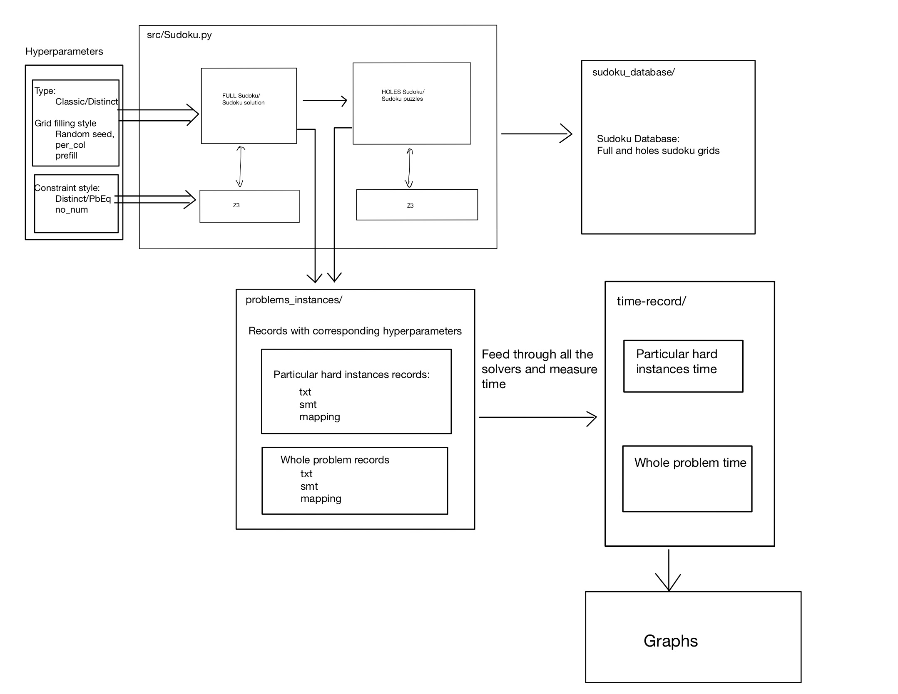

# Argyle_Sudoku
> This project is built on the code provided by Giuseppe Cardone in the blog post "[**Solving the Miracle Sudoku with Microsoft Z3**"](https://www.gcardone.net/2020-06-03-solving-the-miracle-sudoku-in-z3/). 

This project demonstrate how one can utilize the `jz3` package to solve classic sudokus and argyle sudokus with various encoding 
techniques, and then compare the efficiency of each method and between the sudokus. 

In `Sudoku.py` both traditional implementation of adding conditional constraints using if-else
statements and our approach of adding conditional constraints using our custom solver is presented. 
An example of two different ways of querying if an index can be set to a number is presented.

## Directory Structure
- `/analysis`: Includes visualizations scripts and images generated using `jz3`

- `/problem_instances`: 
  - `/particular_hard_instances_records`: Particular hard **instances** identified during the generation process, in txt and SMT format
  - `/whole_problem_records`: **Whole** sudoku problems in txt and SMT format
  - Details of recording format explained [here](sudoku_experiment_demo/problems_instances/README.md)

- `/src`: Contains source code for core functionalities. 
  - `/Sudoku.py`: Contains all functionalities of building sudoku with various constraints, logging sudoku instances to files in string format and smt format. 
  - `/run_sudoku_experiment.py`: This file contains the main function. It takes in a sudoku file and solves it using the methods in sudoku.py. It then prints/ the solution and the time taken to solve it.

- `./sudoku_database/`: Stores the already generated full and holes sudokus
  - `currline.txt`: stores the which line of the full sudokus file should the solver generating sudoku holes start loading from and solving when calling `run_experiment`

- `./time_records/`: Direct directory for storing time records from solver runs, highlighting the performance of different solvers.
  - Details of time recording format is presented [here](./time-record/README.md)

 The workflow is depicted in the following picture: 

